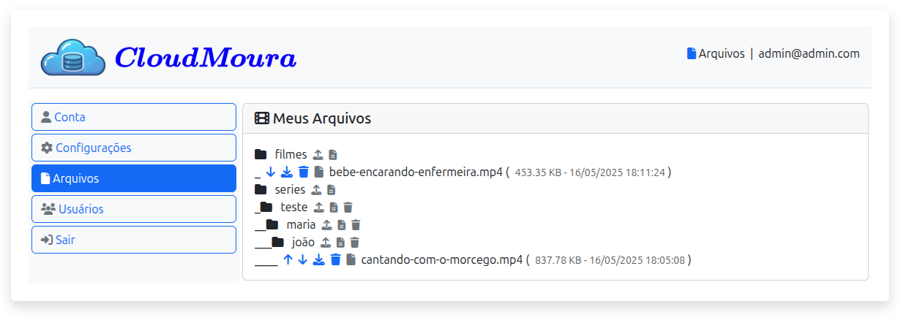
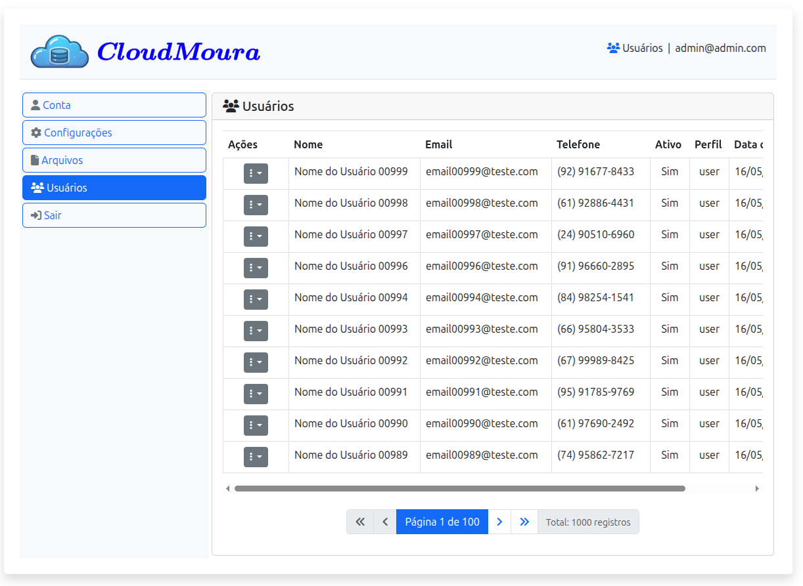

# CloudMoura

CloudMoura é um sistema de gerenciamento em nuvem desenvolvido em PHP, oferecendo uma interface moderna e responsiva para gerenciamento de arquivos pessoais.

## 🚀 Características

- Sistema de autenticação seguro
- Gerenciamento de usuários
- Interface moderna e responsiva
- API RESTful
- Banco de dados SQLite
- Sistema de logs para debug
- Página de manutenção
- Sistema de roles (admin/user)

## 📸 Screenshots




## 📋 Pré-requisitos

- PHP 8.0 ou superior
- SQLite3
- Apache/Nginx
- Composer (para gerenciamento de dependências)

## 🔧 Instalação

1. Clone o repositório:
```bash
git clone https://github.com/seu-usuario/cloudmoura.git
cd cloudmoura
```

2. Docker
```bash
cp docker-compose-default.yml docker-compose.yml
docker-compose up -d
```

3. Acesse o sistema através do navegador:
```
http://seu-servidor/
```

4. Na primeira vez que acessar, tente fazer login com as credenciais padrão (admin@admin.com / Admin01) três vezes. O sistema irá automaticamente:
   - Criar o banco de dados SQLite
   - Criar as tabelas necessárias
   - Configurar o primeiro usuário administrador

Após este processo, você poderá fazer login normalmente com as credenciais padrão.

## 📁 Estrutura do Projeto

```
src/
├── api/             # Endpoints da API REST
├── config/          # Arquivos de configuração
├── data/            # Diretório para dados do SQLite
├── includes/        # Classes e funções auxiliares
├── logs/            # Diretório de logs
├── public/          # Arquivos públicos e ponto de entrada
├── scripts/         # Scripts utilitários
└── uploads/         # Diretório para guardar seus arquivos
```

## 🔐 Credenciais Padrão

- **Email**: admin@admin.com
- **Senha**: Admin01

## 🛠️ Tecnologias Utilizadas

- PHP 8.0+
- SQLite3
- HTML5
- CSS3
- JavaScript
- Bootstrap 5

## 📝 Logs

O sistema mantém logs detalhados para debug e monitoramento. Os logs são armazenados em:
```
src/logs/
```

## 📤 Uploads
O sistema mantém seus arquivos pessoais em:
```
src/uploads/
```

## 🔒 Segurança

- Senhas armazenadas com hash seguro
- Proteção contra SQL Injection
- Validação de entrada de dados
- Sistema de roles para controle de acesso
- Página de manutenção para downtime planejado

## 🤝 Contribuindo

1. Faça um Fork do projeto
2. Crie uma Branch para sua Feature (`git checkout -b feature/AmazingFeature`)
3. Commit suas mudanças (`git commit -m 'Add some AmazingFeature'`)
4. Push para a Branch (`git push origin feature/AmazingFeature`)
5. Abra um Pull Request

## 📄 Licença

Este projeto está sob a licença MIT. Veja o arquivo [LICENSE](LICENSE) para mais detalhes.

## ✨ Agradecimentos

- Equipe de desenvolvimento
- Contribuidores
- Comunidade open source

## 📞 Suporte

Para suporte, envie um email para seu-email@dominio.com ou abra uma issue no GitHub. 